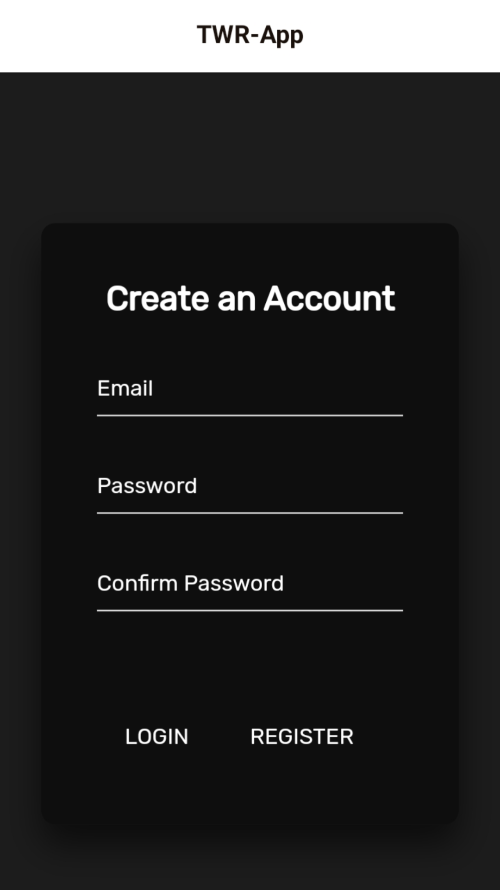
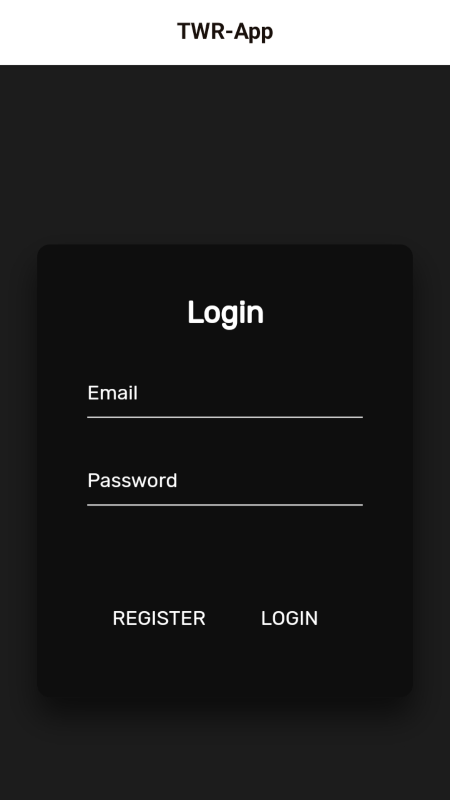
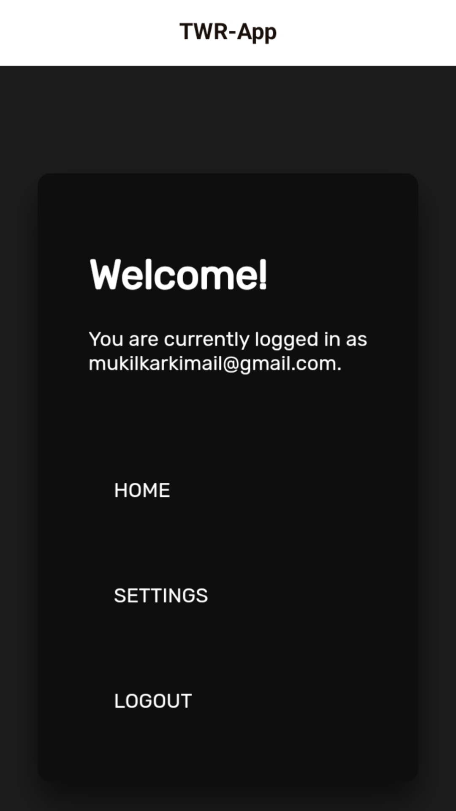
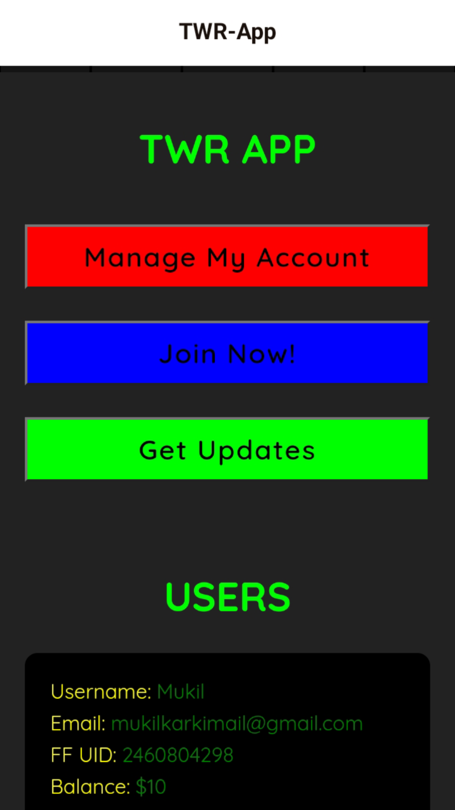
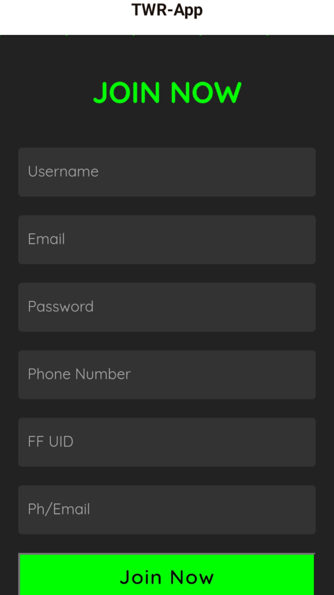
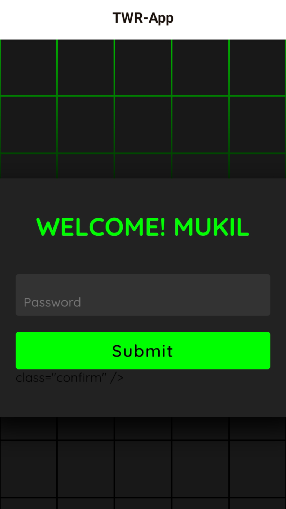
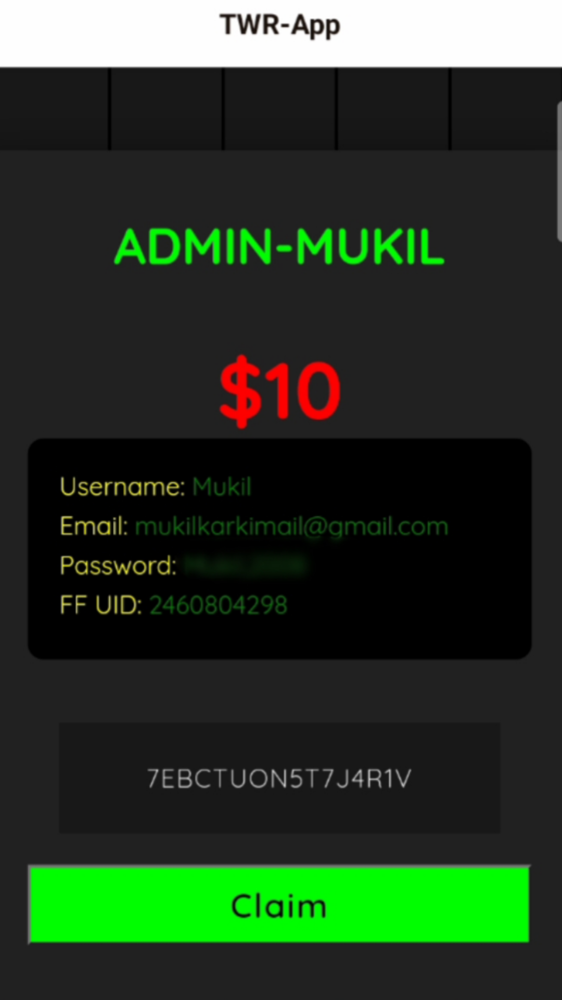

# TWR-App

## Screenshot

## Splash screen

## Create Account screen

## Login screen

## Setting screen

## Home screen

## Join Now! screen

## User Protection screen

## User Dashboard screen

## Description

TWR-App is a cutting-edge Java application developed using Acodex, designed to offer seamless user authentication with Firebase. It features an intuitive UI/UX enhanced with CSS and animations, providing a smooth and engaging experience for users. The app includes functionalities such as sign-in, sign-up, and form input for storing user details in a Firestore database.

## Features

- User authentication with Firebase
- Enhanced UI/UX with CSS and animations
- Form inputs for user details (username, email, password, phone number, FF ID, text)
- Seamless integration with Firestore database

## About the Owner

Hi, I'm Mukil, currently an 11th-grade student with a keen interest in BioMaths and software development. I am passionate about creating user-friendly applications and constantly learning new technologies to improve my skills. This project represents my dedication to combining modern development tools with practical applications.

Feel free to reach out or contribute to this project!

## License

This project is licensed under the MIT License - see the LICENSE file for details.

## Contact

GitHub: mukilkarki

Email: mukilkarkimail@gmail.com
